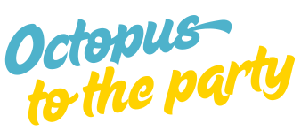

# 🐙 OCTOPUS TO THE PARTY 🐙

## [Play the Game!](https://gaellemde.github.io/octopus-to-the-party/)

# Description

Octopus to the Party is a game where players must catch as many shrimps as possible to feed the little pulpiño, while avoiding the trash that falls into the sea. Each shrimp eaten earns 1 point, but touching trash causes pulpiño to lose 1 life. The game ends when the player loses 5 lives. Afterwards, the score is calculated.

The game raises awareness about environmental pollution while paying tribute to Galician culture. 'Octopus to the party' is a common mistranslation by tourists when referring to the traditional Galician dish 'Pulpo á feira.'"

# Main Functionalities

- The player can control the octopus' movement in all directions—up, down, left, and right—using the arrow keys.
- Shrimps falls automatically from random locations and random frequencies from the top.
- Trash falls automatically from random locations from the top.
- A point is added to the score each time you eat a shrimp.
- One life is deducted with each collision with the trash.
- The game ends when the player loses all 5 lives.

# Backlog Functionalities

- List here all functionalities you wish to add to your proyect later.

# Technologies used

- HTML
- CSS
- Javascript
- DOM Manipulation
- Local Storage
- JS Audio()

# States

- Start Screen
- Game Screen
- Game Over Screen

# Proyect Structure

## main.js

- startGame()
- gameLoop()
- trashDestroy()
- shrimpDestroy()
- checkCollision()
- gameOver()
- restart()
- updatesLives()
- checkCollisionShrimp()
- updatesNumberShrimp()
- playMusicGame()
- playShrimpSound()
- playStartSound()
- playPunchSound()

## Pulpito.js

- Class Pulpito {
  - this.x
  - this.y
  - this.w
  - this.h
  - this.moveright
  - this.moveleft
  - this.moveup
  - this.movedown
    }
- moveRight()
- moveLeft()
- moveUp()
- moveDown()

## Trash.js

- Trash {
  - this.x;
  - this.y;
  - this.w;
  - this.h;
  - this.speed
    }
- automaticMovement()

## Shrimp.js

- Shrimp {
  - this.x;
  - this.y;
  - this.w;
  - this.h;
  - this.speed
    }
- automaticMovement()

# Extra Links

### Slides

[Link](https://www.canva.com/design/DAGm3wk5cjU/TK3_EZw9gFm2q84VcMSo3Q/view?utm_content=DAGm3wk5cjU&utm_campaign=designshare&utm_medium=link2&utm_source=uniquelinks&utlId=h152b2ea237)

## Deploy

[Link](https://gaellemde.github.io/octopus-to-the-party/)
